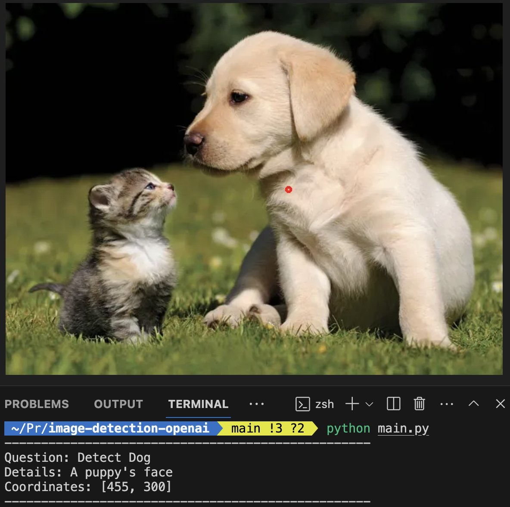

# [ WIP ] Object Detection using OpenAI GPT4-Vision

OpenAI recently introduced GPT-4 with Vision, enhancing their API with multimodal capabilities.

This lets developers create applications where users can ask questions about images.

I was wondering - could we use this model for object detection?
**How do LLMs compare to a specialize object detection models?**

    "Identify the dog in the picture"

### Note

